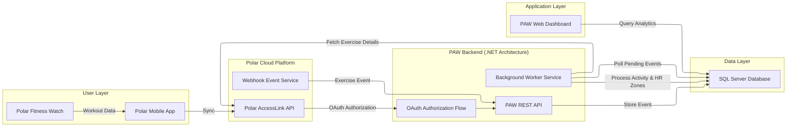

# PAW API - Minimal Architecture Overview

Purpose: Short, entry-level guide showing main components and flows.

Key points for developers

- Projects to inspect:
  - `Paw.Api` - web API (endpoints, auth, controllers)
  - `Paw.Worker` - background processing (uses `BackgroundService`)
  - `Paw.Infrastructure` - DbContext, mappers, repositories
  - `Paw.Core` / `Paw.Polar` - core interfaces and Polar client

- Authentication: requests use header `X-QEP-API-Key` (check middleware).

- OAuth summary:
  1. Client -> `/qep/polar/connect` to start OAuth.
  2. Polar redirects to `/callback` with `code` + `state`.
  3. API exchanges `code` for tokens and saves a `PolarLink`.

- Webhook summary:
  1. Polar posts events to `/webhooks/polar`.
  2. API validates signature and stores `WebhookEvents` with status `Pending`.
  3. `Paw.Worker` processes pending events, fetches exercise details, then saves `Activity` and `HeartRateZones`.

- Quick start:
  - Run API: `make run-api`
  - Run worker: `make run-worker`

Where to look in code:
- Webhooks and signature validation: search `webhook` or `WebhookEvents`.
- OAuth flow: search `connect` or `callback`.
- Activity mapping: `Paw.Infrastructure/Mappers/PolarWorkoutMapper.cs`.

This file is minimal. Follow an endpoint through controller -> service -> repository for a deeper walkthrough.
