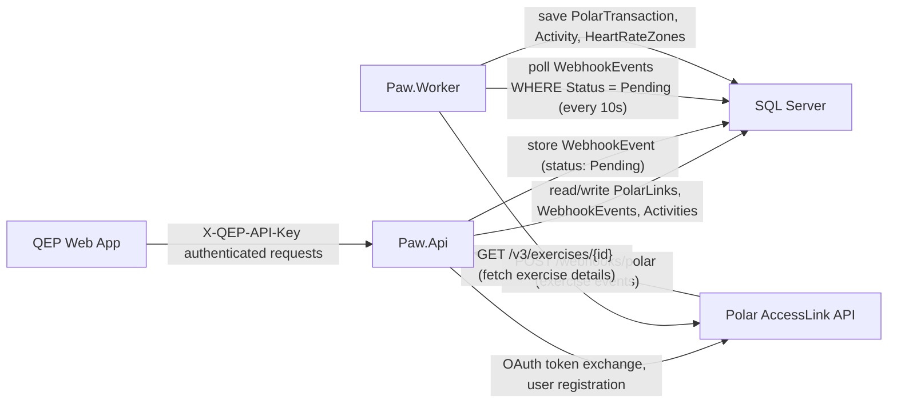
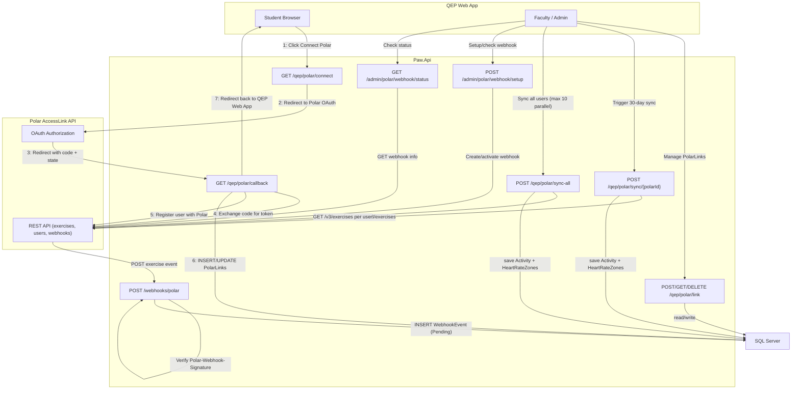
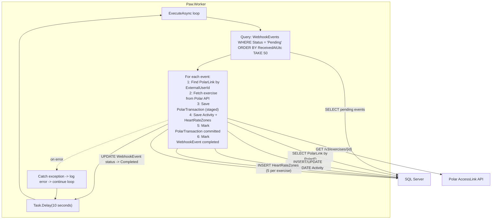

# PAW API - Architecture Overview

Purpose: Guide showing main components and flows.

Key points for developers

- Projects to inspect:
  - `Paw.Api` — web API (endpoints, auth, webhook receiver)
  - `Paw.Worker` — background processing (uses `BackgroundService`)
  - `Paw.Infrastructure` — DbContext, mappers, `ActivitySyncService`
  - `Paw.Core` / `Paw.Polar` — core interfaces and Polar client

- Authentication: QEP Web App requests use header `X-QEP-API-Key` (check middleware). Polar webhook and OAuth callback endpoints are public (no API key).

- OAuth summary:
  1. QEP Web App → `GET /qep/polar/connect?email=...&personId=...` to start OAuth.
  2. Polar redirects to `GET /qep/polar/callback` with `code` + `state`.
  3. API exchanges `code` for access token, registers user with Polar, and saves a `PolarLink` row.

- Webhook summary:
  1. Polar posts exercise events to `POST /webhooks/polar`.
  2. API validates `Polar-Webhook-Signature` header and stores a `WebhookEvent` with status `Pending`.
  3. `Paw.Worker` picks up pending events, fetches exercise details from Polar, then saves `PolarTransaction` + `Activity` + `HeartRateZones`.

- Quick start:
  - Run API: `make run-api`
  - Run worker: `make run-worker`

Where to look in code:
- Webhooks and signature validation: `Paw.Api/Program.cs` (`/webhooks/polar` endpoint), `Paw.Polar/PolarWebhookVerifier.cs`.
- OAuth flow: `Paw.Api/QepPolarEndpoints.cs` (`/connect` and `/callback`).
- Webhook processing + sync: `Paw.Infrastructure/ActivitySyncService.cs`.
- Activity mapping: `Paw.Infrastructure/Mappers/PolarToQepMapper.cs`.

---

## Paw.Api — Detailed Component View

### Paw.Api Endpoints

| Method | Path | Auth | Purpose |
|--------|------|------|---------|
| `GET` | `/qep/polar/connect` | API key (any role) | Start Polar OAuth flow |
| `GET` | `/qep/polar/callback` | None (called by Polar) | Handle OAuth callback, save PolarLink |
| `POST` | `/qep/polar/link` | API key (faculty/admin) | Create or update a PolarLink |
| `GET` | `/qep/polar/link/{polarId}` | API key (any role) | Get a PolarLink by Polar user ID |
| `DELETE` | `/qep/polar/link/{polarId}` | API key (faculty/admin) | Remove a PolarLink |
| `POST` | `/qep/polar/sync/{polarId}` | API key (any role) | 30-day exercise sync for one user |
| `POST` | `/qep/polar/sync-all` | API key (faculty/admin) | 30-day exercise sync for all users |
| `POST` | `/webhooks/polar` | None (called by Polar) | Receive webhook events, store as Pending |
| `POST` | `/admin/polar/webhook/setup` | None | Create or reactivate Polar webhook |
| `GET` | `/admin/polar/webhook/status` | None | Check webhook subscription status |

### What the API writes to SQL Server

| Table | When | What |
|-------|------|------|
| `PolarLinks` | OAuth callback or POST `/link` | Student's Polar connection (PolarID, AccessToken, PersonID) |
| `WebhookEvents` | POST `/webhooks/polar` | Raw event from Polar, status = `Pending` |
| `PolarTransactions` | Sync endpoints | Staged exercise data (committed after Activity save) |
| `Activities` | Sync endpoints | Mapped exercise record (duration, distance, points) |
| `HeartRateZones` | Sync endpoints | 5 HR zones per exercise |

---

## Paw.Worker — Detailed Component View

### How the Worker processes one webhook event

1. **Poll** — Query `WebhookEvents` for up to 50 rows where `Status = 'Pending'`, oldest first.
2. **Find user** — Look up `PolarLinks` by `ExternalUserId` (the Polar user ID from the webhook). If no match, mark event as `Failed`.
3. **Fetch exercise** — Call Polar API `GET /v3/exercises/{entityId}` using the student's `AccessToken` from their PolarLink.
4. **Stage transaction** — Insert or update a `PolarTransaction` row with `IsCommitted = false`. This stores the raw exercise JSON.
5. **Map and save** — Convert the Polar exercise into a QEP `Activity` row and 5 `HeartRateZone` rows using `PolarToQepMapper`. Save to database.
6. **Commit** — Set `PolarTransaction.IsCommitted = true`. This only happens after the Activity save succeeds. If the save fails, the transaction stays uncommitted for retry.
7. **Complete** — Set `WebhookEvent.Status = 'Completed'` and `ProcessedAtUtc`.
8. **Wait** — Sleep 10 seconds, then repeat.

### Error handling

- If any step fails for one event, the Worker logs the error and moves on to the next event in the batch.
- If the entire batch fails (e.g., database is down), the Worker logs the error and waits 10 seconds before trying again.
- The Worker never crashes — all exceptions are caught inside the loop.

### What the Worker writes to SQL Server

| Table | Operation | When |
|-------|-----------|------|
| `WebhookEvents` | UPDATE status -> `Processing` | Start of processing |
| `WebhookEvents` | UPDATE status -> `Completed` or `Failed` | End of processing |
| `PolarTransactions` | INSERT or UPDATE | After fetching exercise from Polar |
| `Activities` | INSERT or UPDATE | After mapping exercise data |
| `HeartRateZones` | INSERT (5 rows per exercise) | After mapping heart rate zones |
