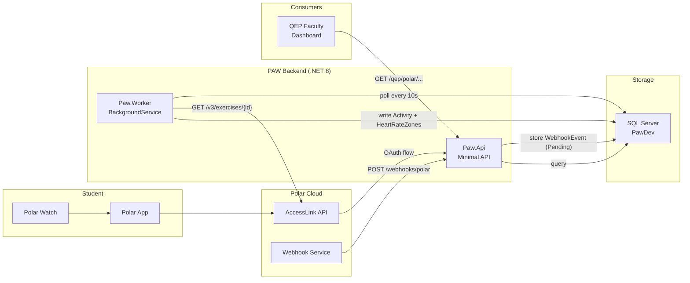

# PAW — Polar Activity Worker

[](https://github.com/your-org/paw/actions/workflows/ci.yml)
[](https://dotnet.microsoft.com/en-us/download/dotnet/8)
[](LICENSE)

> A self-hosted .NET 8 backend that ingests workouts from Polar wearables via OAuth + webhooks, stores them in SQL Server, and exposes a REST API for a QEP faculty grading dashboard.

---

## What it does

- Students connect their Polar accounts via standard OAuth 2.0
- Polar pushes exercise events to PAW's webhook endpoint in real time
- A background worker fetches full exercise details (duration, distance, HR zones) from Polar AccessLink API
- Activity data is persisted to SQL Server and mapped to the QEP aerobic-points scoring formula
- Faculty query aggregated workout stats through a REST API secured with API-key auth

---

## Architecture



---

## Tech stack

| Layer | Technology |
|-------|-----------|
| API framework | ASP.NET Core 8 Minimal APIs |
| ORM | Entity Framework Core 9 + SQL Server |
| Background work | `BackgroundService` (Paw.Worker) |
| Auth | API-key via `X-QEP-API-Key` header (3 roles) |
| Rate limiting | `System.Threading.RateLimiting` (built-in) |
| Testing | NUnit 3.14 · Moq · FluentAssertions · EF In-Memory |
| Docs | Swagger / OpenAPI (dev only) |
| Infra | Docker Compose (SQL Server + Adminer) |

---

## Quickstart (5 minutes)

### Prerequisites

- [.NET 8 SDK](https://dotnet.microsoft.com/en-us/download/dotnet/8)
- [Docker Desktop](https://www.docker.com/products/docker-desktop/)

### Steps

```bash
# 1. Clone
git clone https://github.com/your-org/paw.git && cd paw

# 2. Configure
cp .env.example .env
# Edit .env — set SA_PASSWORD to a strong password

# 3. Start SQL Server
make docker-up

# 4. Apply database migrations
make ef-update-db

# 5. Configure API keys in appsettings.json (or environment variables)
#    QepApiKeys__student, QepApiKeys__QepFaculty, QepApiKeys__QepAdministrator

# 6. Start the API
make run-api          # http://localhost:5293
# In a separate terminal:
make run-worker       # background worker

# 7. Verify
curl http://localhost:5293/health
# → Healthy
```

Swagger UI is available at `http://localhost:5293/swagger` in Development mode.

---

## Configuration

All settings can be overridden with environment variables using the `__` separator
(e.g. `ConnectionStrings__DefaultConnection`).

| Key | Description | Default |
|-----|-------------|---------|
| `ConnectionStrings:DefaultConnection` | SQL Server connection string | localhost:1433 |
| `QepApiKeys:student` | API key for student-facing endpoints | *(empty — must set)* |
| `QepApiKeys:QepFaculty` | API key for faculty endpoints | *(empty — must set)* |
| `QepApiKeys:QepAdministrator` | API key for admin endpoints | *(empty — must set)* |
| `Polar:ClientId` | Polar AccessLink OAuth client ID | *(empty — must set)* |
| `Polar:ClientSecret` | Polar AccessLink OAuth client secret | *(empty — must set)* |
| `Polar:RedirectUri` | OAuth redirect URI registered with Polar | *(must match Polar portal)* |
| `Polar:WebhookUrl` | Public URL Polar will POST events to | *(must be HTTPS, publicly reachable)* |
| `Polar:WebhookSignatureSecret` | HMAC-SHA256 secret returned on webhook creation | *(returned once at setup)* |
| `QepWebAppUrl` | Base URL of the QEP web application | `http://localhost:5002` |
| `QepWebAppRedirectUrl` | OAuth success/failure redirect target | `http://localhost:5002/Polar/Connected` |

---

## API reference

All endpoints under `/qep/polar/*` require `X-QEP-API-Key` header. Role requirements are noted below.

| Method | Route | Role | Description |
|--------|-------|------|-------------|
| `GET` | `/qep/polar/connect` | student/faculty/admin | Start Polar OAuth flow |
| `GET` | `/qep/polar/callback` | public | OAuth callback (called by Polar) |
| `POST` | `/qep/polar/link` | faculty/admin | Create or update a PolarLink record |
| `GET` | `/qep/polar/link/{polarId}` | any role | Get PolarLink by Polar user ID |
| `DELETE` | `/qep/polar/link/{polarId}` | faculty/admin | Remove a PolarLink |
| `POST` | `/qep/polar/sync/{polarId}` | any role | Sync last 30 days for one user |
| `POST` | `/qep/polar/sync-all` | faculty/admin | Sync all active users |
| `POST` | `/admin/polar/webhook/setup` | admin | Register webhook with Polar (run once) |
| `GET` | `/admin/polar/webhook/status` | admin | Check webhook registration status |
| `POST` | `/webhooks/polar` | public (rate-limited) | Receive events from Polar |
| `GET` | `/health` | public | Health check (DB connectivity) |

---

## Running tests

```bash
make test           # Fast suite, ~20-30s (excludes slow worker tests)
make test-all       # Full suite including worker tests, ~40-50s
make test-sync      # Sync logic only, ~5s
make test-endpoints # API endpoint tests, ~5s
make test-webhook   # Webhook E2E pipeline, ~5s
make test-coverage  # HTML coverage report → TestResults/CoverageReport/index.html
```

To run a single test:
```bash
dotnet test Paw.Test/Paw.Test.csproj --filter "FullyQualifiedName~ClassName.TestMethodName"
```

---

## Contributing

See [CONTRIBUTING.md](CONTRIBUTING.md) for local setup, coding conventions, and PR guidelines.
